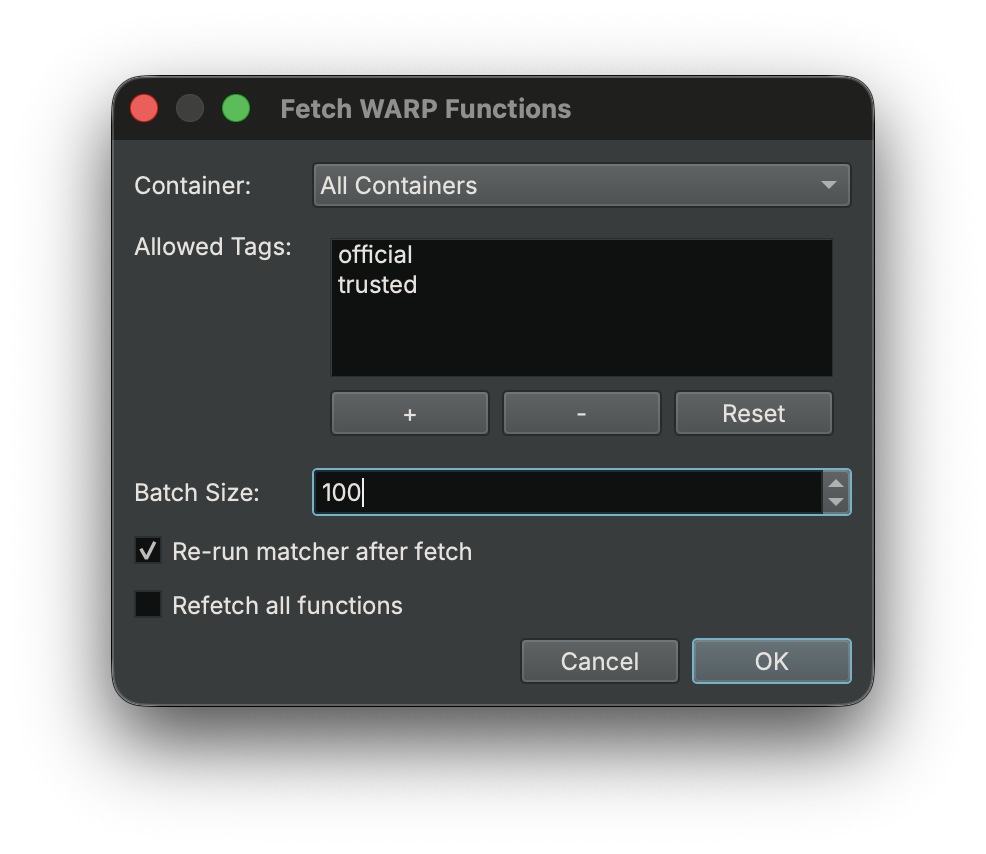

# WARP

Binary Ninja ships a first party plugin for [WARP] a format for transferring analysis
information, such as function names and types. This integration is responsible for matching unique functions in a binary
and automatically applying information to the analysis. As well as providing the user the ability to select from a set
of possible functions, when identifying the unique function fails.

The bundled plugin is open source and is located [here](https://github.com/Vector35/binaryninja-api/tree/dev/plugins/warp).

## How WARP Works

WARP works by making a function GUID based off the byte contents of the function. Because WARP creates this GUID based
off the byte contents, the functions are expected to be an exact match, aside from variant instructions.
To use WARP, you only need to know that the function GUID's must match across binaries for the function information to be considered.

To read more about how WARP works, please see the GitHub repository [here](https://github.com/vector35/warp).

### Applied Function Information

When a function matches, we will apply the following information:

- Symbol
    - Name
    - Demangled type
- User defined type
    - Calling convention
    - Parameter names
    - Parameter types
    - Return type
- User defined variables
    - Name
    - Type
- Comments

## Loading WARP Files

### Automatically on start

Files are automatically loaded from two locations when Binary Ninja starts:

- [Install Directory] + `/signatures/`
    - Can be disabled using the setting `warp.container.loadBundledFiles`.
- [User Directory] + `/signatures/`
    - Can be disabled using the setting `warp.container.loadUserFiles`.

???+ Danger "Warning"
    Always place your signature libraries in your user directory. The installation path is wiped whenever Binary Ninja auto-updates. You can locate it with `Open Plugin Folder` in the command palette and navigate "up" a directory.

### Manually

Aside from using the signature directory you can load any WARP file manually using the
command `WARP\\Load File` or via the UI sidebar, they both do the same thing. Once the file is
loaded, you do not need to load if for every view, it is available globally.

???+ Info "Tip"
    When loading signatures you may encounter a dialog asking to "Override file target?" this happens when your file
    has a different platform, which is common if you are working with firmware where the intermediate libraries may be
    detected as a different target, this is OK you can continue loading, and it will change the file target to fit the view.

## Creating WARP Files

Before you actually can create these WARP files, you must identify the binary files relevant to the target binary. Once
that is done, you can determine which of the following procedures is best:

=== "From the current view"
    You can create signatures for the current view by running the
    command `WARP\\Create\\From View` or by hitting the associated
    button in the WARP sidebar.

    

=== "From a file"
    Using the command `WARP\\Create\\From File(s)` you can create
    a signature file for an external file. This is useful if you
    are generating signatures for library files (`.a`, `.lib`, `.rlib`).

    

=== "From the current project"
    When dealing with a large dataset, you will want a way to process
    files in parallel, using the `WARP\\Create\\From Project` command
    you can generate signatures for any set of files in a project, this
    includes archive formats like library files (`.a`, `.lib`, `.rlib`).

    

???+ Info "Tip"
    You can also create signature files using the provided API, see the [API section](#api) for more details.

Both the file and project signature creation support loading the following file formats:

- Binary files (`.exe`, `.so`, `.dylib`)
- WARP files (`.warp`)
    - Useful when merging multiple warp files in a project.
- BNDB files (`.bndb`)
    - Using a database will allow you to mark up the function information and also cut down on processing time as the required information has already been created prior to processing.
- Archive files (`.a`, `.lib`, `.rlib`)
    - The archive entry files will be extracted to a temporary directory for processing.

### Including specific functions

Sometimes you may not want to include every function but a subset, in that case you can tag functions to include with
the command `WARP\\Include Function` (or add the tag yourself with `"WARP: Selected Function"`) once you have selected all
the functions you want, you can run the create command. If you are trying to add functions to an existing warp file, you
will be prompted whether you want to keep the existing data, you will want to say yes.

### File size

Information in the WARP file will be deduplicated across all processed files automatically.
If your files are too large, try and adjust the file data to something like "Symbols" only, and if you are looking to
make the files load quicker, turn off compression.

## Networked Functionality

WARP for Binary Ninja provides the ability to lazily pull data (functions, types) from a WARP server, by default, networked
functionality is disabled, as it requires sending the functions platform (`windows-x86`) and GUID (`2f893a32-8592-54e2-8052-207603976686`)
which can be considered sensitive information, see [Connecting](#connecting) to learn how to enable this functionality.

### Connecting

To enable turn on `network.enableWARP` and restart, server connection settings exist in the regular WARP setting group, 
and the default primary server is https://warp.binary.ninja. You can also give it an API token so that you can be logged 
in as your user, and have access to push data to your sources using `warp.container.serverApiKey`.

Once restarted, you should see a log message indicating you have connected. You can also verify connections in the WARP 
sidebar under the "Containers" tab which should list the provided WARP server(s) alongside any of your sources you have created.

### Pulling Networked Data

To pull networked data, you must have successfully connected and have an open binary view, after which,
you can use the command `WARP\\Fetch` or using the ⬇ button within the WARP sidebar. This will open a
dialog which will, in batches, pull down all the necessary data for matching all functions in a binary.

By default, we will only ever pull down data from "official" and "trusted" tagged sources. You can change the default 
globally by modifying the setting `warp.fetcher.allowedSourceTags` as a comma separated list. These tags are assigned
from within the server UI, either by source users or the server admin, the tags "official" and "trusted" may only be added
or removed by the server admin.

???+ Info "Tip"
    Fetching of function information from the server will also be done on demand when navigating to a function for the first time
    with the WARP sidebar open. The fetched functions will be shown in the "Matched Functions" sidebar automatically, however,
    you will need to run the matcher to apply the information to the analysis.

In the case where you want fetching to be done automatically, set `analysis.warp.fetcher` to true, this will cause the fetcher
to run at the end of the analysis, useful if you are working with binaries headlessly and do not mind waiting for the fetcher
to complete.

### Pushing Networked Data

To push data to the server, you must provide an API key. This can be done either self-service or by the server admin.

To get an API key using the website:

1. Navigate to the account settings page (https://warp.binary.ninja/account)
2. Give a name to the key and hit "Add Key"
3. Copy the API key and open Binary Ninja
4. Paste the API key into the setting `warp.container.serverApiKey`

Once restarted, you should see a log message indicating you have connected as the associated user.

After logging in, you can create a new source on the server by right-clicking in the container sources tab and selecting
"Add Source" you can also do this via the website. 

Once you have created a source, you can start pushing your WARP files to them using the command `WARP\\Commit File` or 
using the ⬆ button within the WARP sidebar.

## Overwriting Matched Functions

WARP will not always be able to identify the unique function in the matcher. In this case we give the user a few
options for resolving the matched function:

- Using the WARP sidebar, you can view and set the matched function
    - In the "Current Function" tab, double-click on any possible function (or right-click and hit Apply)
- Using the [API](#api), you can query possible functions and then set the matched function

All matched functions are stored in the BNDB, so you do not need to provide signature files when distributing databases.

## Removing Matched Functions

Using the command "WARP\\Remove Matched Function" or via the context menu in the WARP sidebar, you can remove matched function
information. You may also want to run the complementary command `WARP\\Ignore Function` which will prevent the selected function 
from being matched automatically in the future.

## API

To create, query and load WARP data programmatically, we provide a [Python API]. For those looking to interact with WARP
from Rust because the plugin is open source, you can depend _directly_ on the [Rust plugin], skipping the FFI entirely.

### Rust example (recommended)

This example will use the Rust API directly to generate WARP files from given inputs, it will automatically parallelize
the work, so it will be much faster than the Python example.

Find the example [here](https://github.com/Vector35/binaryninja-api/tree/dev/plugins/warp/examples/headless).

### Python example

This example will open a binary in Binary Ninja then output a WARP signature file.

The flexibility of the API allows you to include or exclude any functions you want from the creation of the signature file.

Find the example [here](https://github.com/Vector35/binaryninja-api/tree/dev/plugins/warp/examples/create_signatures.py).

## Troubleshooting

### Why do these very similar functions have a different function GUID?

WARP is an exact function matcher, even small changes like a different register will change the GUID. The point of WARP is
to provide an inexpensive base layer of function matching and an open source file format for sharing analysis information.

### Why does the exact same function have a different function GUID?

Using the render layer, you can identify differences in the two functions GUID construction:

- Highlighted red is "variant instruction"
- Highlighted yellow is "computed variant instruction"
- Highlighted black is "blacklisted instruction"

The function GUID will differ if the instruction highlights are not exactly the same across all instructions in both functions.

### No relocatable regions found

When running the matcher manually, you may get a warning about no relocatable regions found; this means you have no defined
sections or segments in your view. For WARP to work we must have some range of address space to work with, without it the
function GUID's will likely be inconsistent if the functions can be based at different addresses.

### Failed to connect to the server

If you fail to connect to a WARP server, you will receive an error in the log. Outside typical network connectivity issues 
it is possible the provided server URL is malformed, verify that the URL looks similar to the default server URL: `https://warp.binary.ninja`

## Glossary

Here is a list of terms used and a simplified description, please see the [WARP] spec repository for a more detailed description.

### Target
A **Target** defines platform-specific information needed to filter out irrelevant WARP information.

### Container
A **Container** stores and manages WARP data, whether in memory, on disk or over the network. Each container has its own collection of sources.

### Source
A **Source** is a collection of WARP data within a container, like a file containing function and type information.

### Source Tag
A **Source Tag** is an arbitrary string that is used for filtering fetched function data from containers, useful when dealing with larger potentially
untrusted datasets.

### Function
A **Function** in WARP represents the collection of metadata that we wish to transfer, such as the symbol, comments and types.

### Function GUID
A **Function GUID** is a unique ID derived from the contents of the function, allowing matching across different binaries.

### Constraint
A **Constraint** helps ensure accurate function matching by verifying specific properties are shared between functions.
For example, a referenced function would be used as a constraint.

[WARP]: https://github.com/vector35/warp
[Install Directory]: https://docs.binary.ninja/guide/#binary-folder
[User Directory]: https://docs.binary.ninja/guide/#user-folder
[Python API]: https://github.com/Vector35/binaryninja-api/blob/dev/plugins/warp/api/python/warp.py
[Rust plugin]: https://github.com/Vector35/binaryninja-api/tree/dev/plugins/warp
